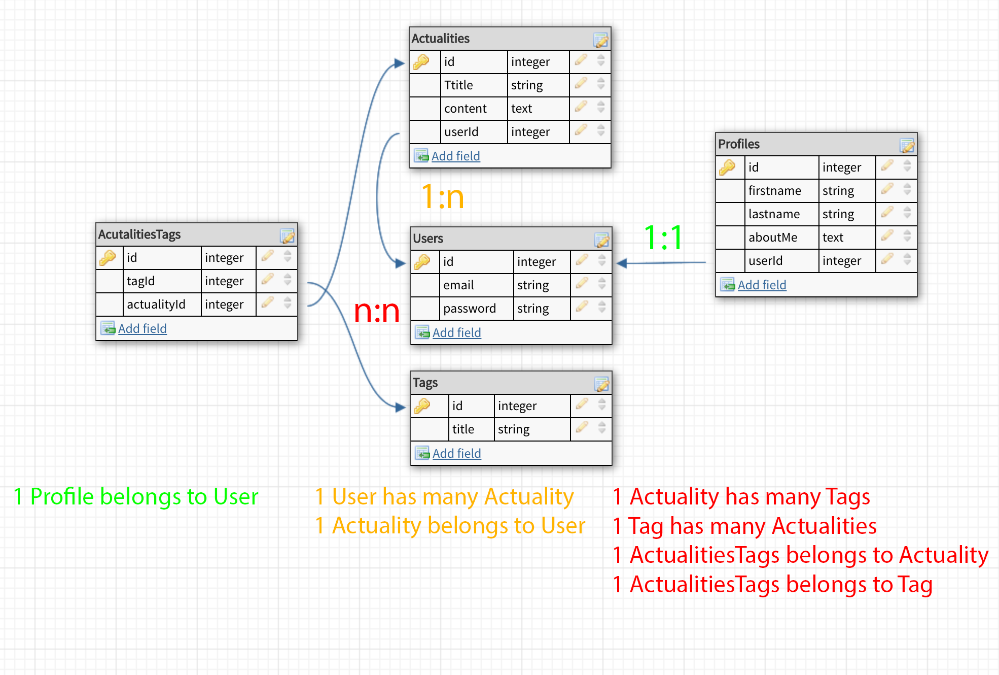

# Node.JS and Sequelize
## Setup
```shell
mysql -u root -p # Connect to mysql shell
mysql > CREATE DATABASE my_db_name; # Create a new databse
Query OK, 1 row affected (0.01 sec)
mysql> exit

express my_project_name --no-view
cd my_project_name
npm i --save sequelize mysql2
sequelize init

Created "config/config.json"
Successfully created models folder at "/Users/eth3rnit3/code/WildCodeSchool/nodeProjects/express_relationship/models".
Successfully created migrations folder at "/Users/eth3rnit3/code/WildCodeSchool/nodeProjects/express_relationship/migrations".
Successfully created seeders folder at "/Users/eth3rnit3/code/WildCodeSchool/nodeProjects/express_relationship/seeders".
```

configure your `config/config.json` file

## Models and Migrations
In this tutorial we will create 5 models with the 3 differents relationship

### Models
- User
- Profile
- Actuality
- Tag
- TagActuality ( joining table )
### Relationship
- 1:1 User has one Profile
- 1:n User has many Actualities
- n:n Tag has many Actualities & Actuality has many Tags
### Models generation with sequelize
```shell
sequelize model:generate --name User --attributes email:string,password:string # Generate User model
sequelize model:generate --name Profile --attributes firstname:string,lastname:string,aboutMe:text,userId:integer # Generate Profile model
model:generate --name Actuality --attributes title:string,content:text,userId:integer # Generate Actuality model
sequelize model:generate --name Tag --attributes title:string  # Generate Tag model
sequelize model:generate --name ActualitiesTag --attributes actualityId:integer,tagId:integer # Generate ActualitiesTag model (joining table)
```
### Configure migrations
We need to configure all migrations with a foreingKey so we must configure 3 files in the same way.
For all fields as a foreingKey we need to add a references object like this
```javascript
// Profile migration file
userId: {
  type: Sequelize.INTEGER,
  references: {
    model: 'Users',
    key: 'id'
  }
}

// Actuality migration file
userId: {
  type: Sequelize.INTEGER,
  references: {
    model: 'Users',
    key: 'id'
  }
}

// ActualitiesTags migration file
actualityId: {
  type: Sequelize.INTEGER,
  references: {
    model: 'Actualities',
    key: 'id'
  }
},
tagId: {
  type: Sequelize.INTEGER,
  references: {
    model: 'Tags',
    key: 'id'
  }
},
```
After you can run
```shell
sequelize db:migrate

Sequelize CLI [Node: 8.11.3, CLI: 4.1.1, ORM: 4.41.2]

Loaded configuration file "config/config.json".
Using environment "development".
== 20181123122720-create-user: migrating =======
== 20181123122720-create-user: migrated (0.027s)

== 20181123122759-create-profile: migrating =======
== 20181123122759-create-profile: migrated (0.025s)

== 20181123123953-create-actuality: migrating =======
== 20181123123953-create-actuality: migrated (0.019s)

== 20181123124028-create-tag: migrating =======
== 20181123124028-create-tag: migrated (0.016s)

== 20181123124145-create-actualities-tag: migrating =======
== 20181123124145-create-actualities-tag: migrated (0.020s)
```

TODO
Relationner les modèle, creer des seed et tout tester